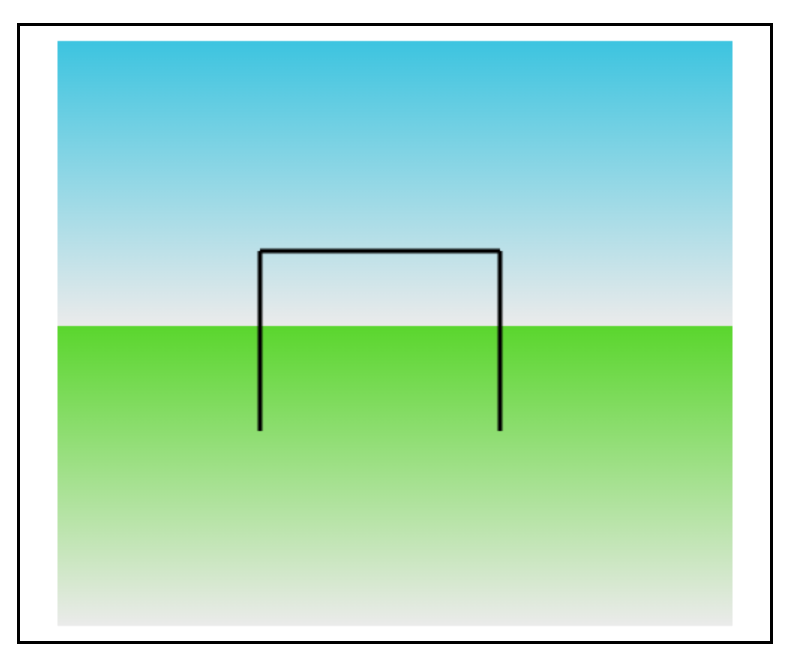

# Task 1: Rectangles and Lines

This task involves drawing two rectangles and three lines on an HTML canvas.

## Description

In Task 1, two rectangles and three lines are drawn on an HTML canvas using the Canvas API.

## Contents

- **index.html**: Main HTML file containing the canvas element.
- **script.js**: JavaScript file containing the code to draw rectangles and lines on the canvas.

## Usage

Open the `index.html` file in a web browser to view the canvas with the rectangles and lines drawn.

## Example

## Contributing

Contributions are welcome! Feel free to submit pull requests or raise issues for any bugs or feature requests.
