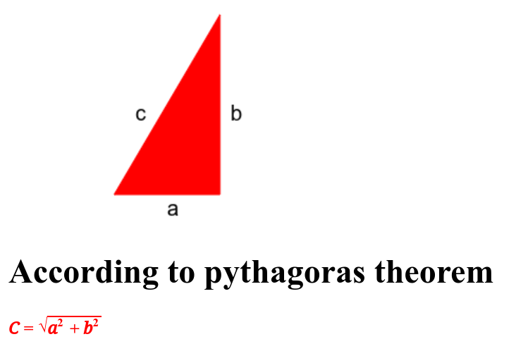

# Task 3: Triangle and Letters

This task involves drawing a triangle and labeling its vertices with letters on an HTML canvas.

## Description

In Task 3, a triangle is drawn on an HTML canvas, and the letters 'a', 'b', and 'c' are placed near the vertices of the triangle.

## Contents

- **index.html**: Main HTML file containing the canvas element.
- **script.js**: JavaScript file containing the code to draw the triangle and letters on the canvas.

## Usage

Open the `index.html` file in a web browser to view the canvas with the triangle and letters drawn.

## Example

## Contributing

Contributions are welcome! Feel free to submit pull requests or raise issues for any bugs or feature requests.

