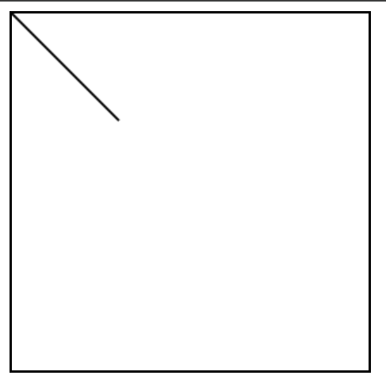
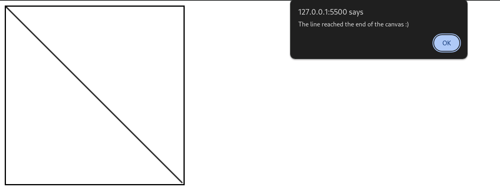

# Task 4: Moving Line

This task involves drawing a line that moves across the HTML canvas.

## Description

In Task 4, a line is drawn on an HTML canvas, and it moves diagonally across the canvas. An alert message is displayed when the line reaches the end of the canvas.

## Contents

- **index.html**: Main HTML file containing the canvas element.
- **script.js**: JavaScript file containing the code to draw and animate the line on the canvas.

## Usage

Open the `index.html` file in a web browser to view the canvas with the moving line.

## Example

## Contributing

Contributions are welcome! Feel free to submit pull requests or raise issues for any bugs or feature requests.

