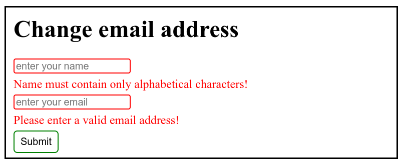
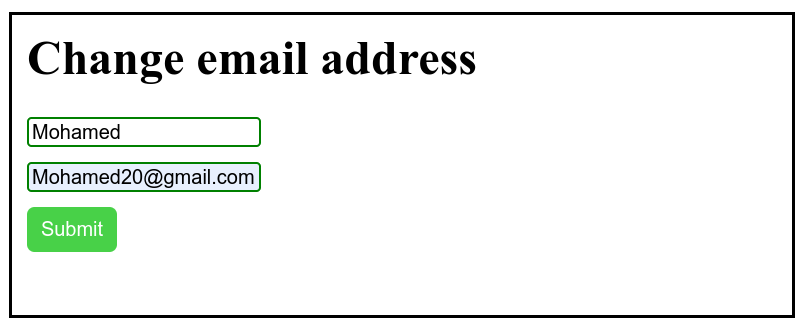

# Task 1

This task involves creating a simple form to change an email address. The HTML structure consists of a `<form>` element containing `<input>` fields for name and email, along with associated `` elements to display error messages. The form fields are validated using HTML5 attributes like `required` and `pattern`.

The CSS styles the form elements, providing visual feedback for valid and invalid inputs. It sets border colors for valid and invalid inputs, displays error messages when inputs are invalid, and adjusts the appearance of the submit button on hover.

## Sample Output

- **invalid**:

- **valid**:
