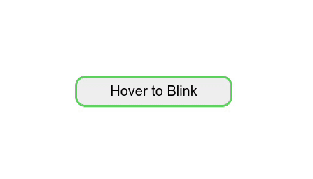

# Task 2

This task involves creating a button with a hover effect that makes it blink. The HTML consists of a simple button element. The CSS styles the button with a border, background color, and box-shadow, and defines a keyframe animation for the hover effect.

On hover, the button background color changes, a box-shadow is added, and it starts blinking using the defined animation.

