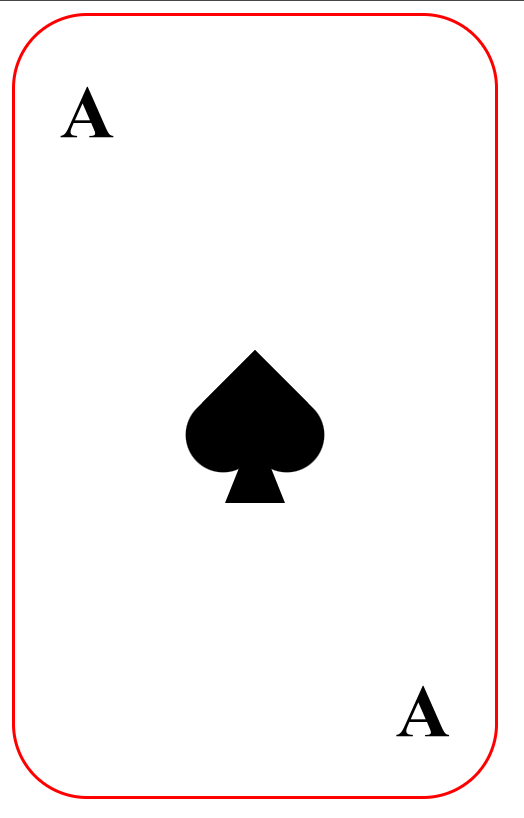

# Task 3

This task involves creating a decorative design using HTML and CSS. The HTML contains a `
` element with multiple `
` elements inside to represent text and shapes such as a heart and a triangle.

The CSS styles the elements to position them correctly and applies transformations to rotate the heart shape. The heart and triangle shapes are created using pseudo-elements `::before` and `::after`.

